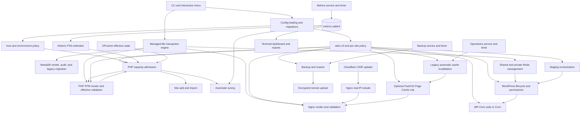

# 05 - Feature and Dependency Map

## Purpose

This document maps the current `10.0.4` implementation before any v11 deletion. The important distinction is between source adjacency and operational coupling: two functions being near each other in `wp-shell.sh` is harmless, while a timer, state file, generated Nginx include, or effective PHP pool creates a compatibility obligation even after its generating command is removed.

The proposed v11 remains a single distributed `wp-shell.sh`. These boundaries are responsibility boundaries for staged deletion and testing, not a proposal for mandatory runtime modules.

## Current control and data flow



## Core dependency chains to preserve

### Site identity and lifecycle

```text
sites.v3
 -> site path and symlink validation
 -> per-site system user/group
 -> per-site PHP-FPM pool/socket/status socket
 -> Nginx upstream/virtual host
 -> wp-config.php safe write window and final permissions
 -> site status, backup and restore selectors
```

This is the central Core chain. A v11 simplification must not replace the per-site identity with a shared `www-data` execution model merely to delete code. Imported sites need the same capacity and path admission as newly created sites, while preserving the v10.0.4 imported-site write-window and final `core is-installed` safeguards.

### Managed-configuration transaction

```text
desired state
 -> render candidate in a secure temporary directory
 -> syntax and semantic validation
 -> timestamped/exact transaction backup
 -> atomic replacement
 -> final validation
 -> reload only changed services
 -> effective verification
 -> committed fingerprints
```

All Core configuration writers depend on this chain. Feature removal must not bypass it by introducing direct `sed -i`, redirection to a live file, or unconditional service restarts.

### PHP capacity admission

```text
physical RAM
 + fixed/non-FPM reserves
 + active PHP versions and OPcache reserves
 + current effective default pools
 + current effective managed pools
 + desired manual limits
 + conservative/current-PSS worker estimate
 -> aggregate hard admission
 -> write permission for any PHP pool change
```

The historic SQLite input may be removed only after a safe replacement for its upward PSS signal exists. Effective pool inspection, aggregate overrides, imported-site admission, post-write semantic verification, and rollback are independent of the dashboard/tuner and must remain.

### MariaDB legacy safety

```text
all recognized MariaDB option files
 + runtime/effective variables and status
 -> conflict and high-risk audit
 -> normal apply admission
 -> explicit confirmed legacy migration
 -> exact file rollback if restart/health verification fails
```

This chain is Core. It owns only recognized legacy and wp-shell-managed definitions; administrator-owned files remain diagnostic inputs, not deletion targets.

### Backup and conservative restore

```text
site selector and validated root
 -> disk-headroom admission
 -> database dump and file archive
 -> manifest/checksums/completeness verification
 -> optional disposable-database deep verification
 -> retention without deleting the last valid backup

requested restore backup
 -> deep verification
 -> verified current-site safety backup with exact ID
 -> proven maintenance mode
 -> files/database/permissions restore
 -> non-mutating WordPress verification
 -> exit maintenance on success
 -> fail-closed maintenance and exact safety-backup recovery command on failure
```

Remote transfer is not part of the integrity chain. It is a separate retention transport and can be externalized after compatibility migration proves that off-host protection will not silently disappear.

## Optional and removable dependency clusters

| Cluster | Current inputs | Persistent/runtime outputs | Coupling that must be broken safely | v11 decision |
|---|---|---|---|---|
| Historical monitoring | `/proc`, Nginx logs, FPM status, MariaDB/Redis counters, site state | SQLite database, cursors, health markers, service/timer | Capacity estimator, dashboard, analyzer and tuner consume the same database | Remove history; replace only the upward worker-memory safety signal |
| Dashboard/reporting | SQLite tables and terminal geometry | Curses UI only | Embeds a large Python program and exposes metrics terminology in menus/docs | Remove |
| Automatic tuner | SQLite history, recommendations, `tuning.v1`, current pools | Pool edits, recommendation files | Shares the hard admission path; deletion must not delete admission or manual desired state | Remove automation; keep manual worker state and admission |
| Advanced OPcache management | PHP INI, FPM status/CGI probes, metrics | Generated override, status and tuning commands | Capacity needs effective per-version reserve, not a mutation UI | Remove UI/mutation; retain conservative baseline and read-only accounting |
| Private Redis | site policy, credentials, sockets, systemd template instances | Per-site configs, secrets, services and metrics | WordPress object-cache state and existing plugin config can depend on it | No new instances; preserve existing state until explicit external migration |
| FastCGI Page Cache Lite | explicit per-site state, WordPress/WooCommerce property, Nginx template | per-site cache directory and deterministic bypass rules | FastCGI transport and optional simple page caching remain useful Core behavior | Keep default-off on/off/status/manual-clear; no plugin discovery, MU plugin, timer, metrics or tuning |
| Legacy cache orchestration | MU plugin, arbitrary exclusions and plugin-aware route/cookie policy | invalidation events and operations timer | Existing public behavior/custom rules must not disappear during upgrade | Remove producer only through explicit migration; preserve administrator rules |
| Cloudflare | official CIDRs and optional updater | trusted real-IP include and two units | Login limits/logs need the real visitor IP | Keep only verified real-IP trust; no API/DNS/APO/cache ownership |
| Remote backup | local verified backup, encryption policy, rclone | encrypted remote objects, timer/log state | It may be the operator's only off-host recovery copy | Externalize only after explicit replacement/acknowledgement |
| Staging | production site state, path/database transformations | cloned files/database/Nginx/site policy | Plugin behavior, mail and Cron assumptions are application-specific | Remove/externalize; preserve detected existing routes |
| Application operations | WordPress update APIs, Cron, Action Scheduler, cache queues | background mutations and logs | Can send mail, rebuild caches or change plugins/themes | Remove bulk upgrades and plugin-specific logic; keep optional simple WP-Cron only |
| Generic host management | AIDE, Postfix, unattended-upgrades | Cron/drop-ins/configs | These have distribution-native ownership and site-specific policy | Externalize/document; do not silently undo existing settings |

## Persistent coupling boundaries

Removing a CLI verb is not sufficient when any of these still exist:

- a systemd service or timer that calls the verb;
- a Cron file that calls the verb;
- an Nginx include or site policy that changes public behavior;
- a Redis socket, password file, or object-cache drop-in;
- a remote-backup policy or evidence that the host relies on remote retention;
- a SQLite database, recommendation file, or cursor that may be needed for audit/rollback evidence;
- a compatibility wrapper or automation using the old command form.

The v10 migration preflight must enumerate these edges. Confirmed migration may stop or disable a retired producer, but it preserves files/data and records the previous enablement state for rollback.

## Package and runtime dependencies

### Current mandatory package surface

`install_system_packages()` currently installs 19 base packages, followed by 12 PHP packages for every installed PHP version. The base set includes dependencies for removed subsystems, notably SQLite and FastCGI probing. The runtime also embeds Python for archive/CIDR validation and the dashboard.

The target is not “Bash only.” Python remains justified for safe tar-member validation and strict IP/CIDR parsing already available on supported Ubuntu releases. Replacing it with a new archive library or network parser would add more risk than it removes. The large curses dashboard program is the part to delete.

| Dependency | Current use | v11 disposition | Reason |
|---|---|---|---|
| Bash/coreutils/systemd tools | Main runtime and service management | Keep | Native platform baseline |
| Nginx, PHP-FPM, MariaDB, Redis | Web stack | Keep | Core product purpose |
| WP-CLI | WordPress lifecycle and verification | Keep | Smallest reliable application control surface |
| Certbot Nginx plugin | TLS lifecycle | Keep | Core public-site requirement |
| Fail2ban and UFW | SSH/network baseline | Keep, explicit | Minimal host safety; avoid web-application bans behind a proxy |
| Python 3 | Safe archive/CIDR parsing, dashboard | Keep parser uses; remove dashboard use | Already present on Ubuntu and avoids unsafe shell parsing |
| SQLite 3 | Historical metrics | Remove from new baseline after S1 migration | No Core consumer remains |
| `libfcgi-bin` | FPM probing/metrics | Re-evaluate after S1/S2 | Retain only if effective Core health checks require it |
| `jq` | WordPress release metadata and JSON handling | Keep unless existing Python safely replaces all uses | Avoid dependency churn in S0/S1 |
| `acl` tools | Legacy/imported isolation paths when used | Install on demand or admit failure explicitly | Per-site isolation cannot silently degrade |
| rclone | Remote backup | External | Transport ownership moves outside Core |
| AIDE, Postfix, unattended-upgrades | Generic host policy | External | Distribution/administrator concerns |

No new daemon, database, language, package repository, or public port is justified by this design.

## Five largest complexity/coupling drivers

1. **Historical metrics -> dashboard -> analyzer -> tuner.** One-minute collection, six tables, cursors, retention, Python UI, resource analysis and mutation recommendations form a second product inside the installer. The PHP estimator dependency is the only safety edge that must be replaced before deletion.
2. **Site policy as a feature switchboard.** One per-site policy currently controls caching, Redis, staging, security headers, Cron, TLS and more. Rendering or repairing a site can therefore mutate unrelated behavior. v11 should narrow policy ownership while retaining unknown keys during migration.
3. **Backup/restore plus remote transport.** Local integrity, retention, encryption, rclone, timers and restore are interwoven. Core should own a verified local artifact and conservative recovery, while transport becomes an explicit external responsibility.
4. **Private Redis and FastCGI cache orchestration.** Credentials, services, sockets, WordPress drop-ins, arbitrary exclusions, event queues and timers create the disproportionate cost. Page Cache Lite retains only deterministic Nginx state and an explicit manual clear.
5. **Broad host/application operations.** SSH/UFW, AIDE, mail, unattended upgrades, WordPress bulk upgrades, Action Scheduler and staging make `apply`, status and the menu ambiguous. Only small platform invariants remain Core; application/plugin policy stays with the site owner.

## Safe edge-cutting order

1. Replace historical PSS consumption with conservative current-state capacity evidence.
2. Stop producing metrics/recommendations through an explicit, reversible migration; retain data.
3. Delete dashboard/analyzer/tuner code and their packages after no Core call edge remains.
4. Add compatibility discovery for cache-auto/custom cache rules, private Redis, remote backup and staging before disabling any producer.
5. Replace new cache orchestration with default-off Page Cache Lite while preserving effective legacy/custom behavior; remove new-configuration paths for the other optional clusters.
6. Migrate or externalize each installed optional feature independently; only then delete its compatibility renderer/handler.
7. Implement conservative restore as its own later change, independent of the feature-removal work.

At every step, a successful Core apply must remain unable to alter an out-of-scope administrator or compatibility-owned file.
